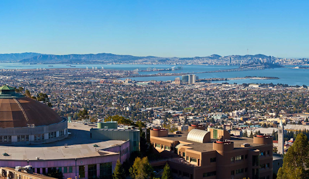

# A Brief History

> On a mission to make autonomous data collection available to everyone.

## The early days

The project started in August 2017.
Back then, the majority of synchrotron light source experiments were run by using either an automated schedule,
or the experimenters intuition.
CAMERA, in collaboration with the Brookhaven National Laboratory,
quickly developed a Kriging-based framework to provide first aid.
Later, the formulation was changed to a Gaussian Process and the tool was called gpCAM in late 2019.
:::{figure-md} lbnl-als-bay-figure
:align: center

A view of the San Francisco Bay with the ALS synchrotron in the foreground
:::

## Where we are today

Today, gpCAM is used across the US and Europe for autonomous data acquisition for simulations and experiments.
It has become a powerful and flexible Gaussian-process framework
that makes it easy for people to put their own domain knowledge into the steering
and to effectively find features of interests,
such as materials with particularly desirable characteristics.
gpCAM shows what can be accomplished when mathematicians, computer scientists
and practitioners come together to solve problems in science and engineering. 