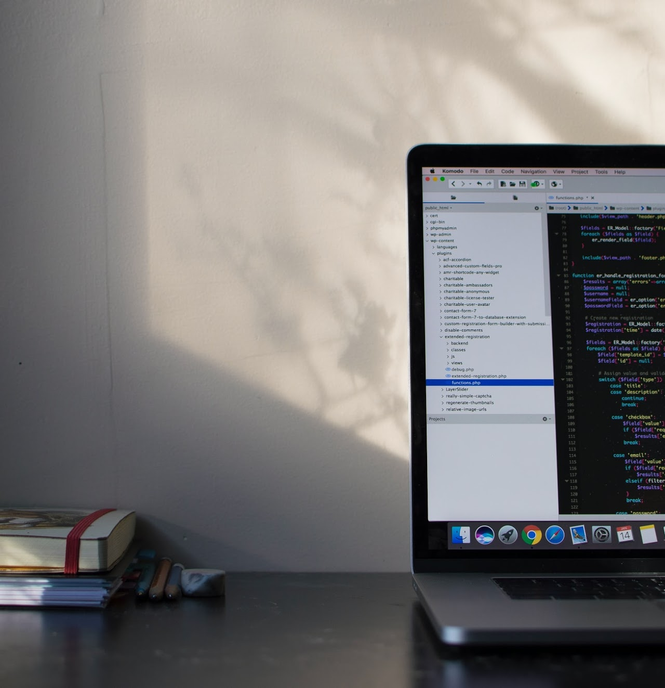
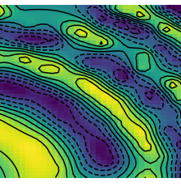
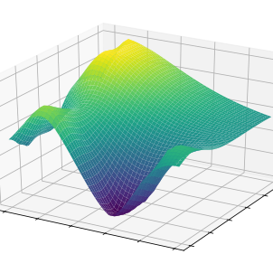
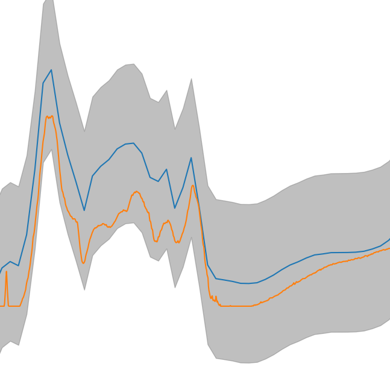
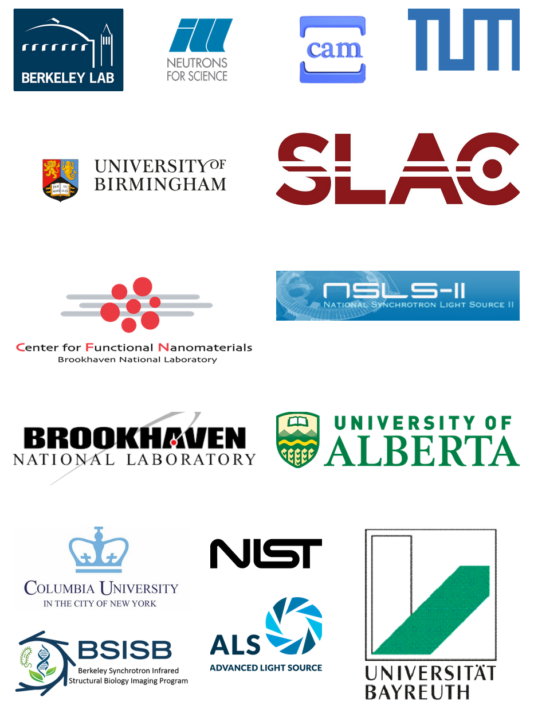

```{toctree}
---
hidden: true
maxdepth: 2
caption: API
---
api/index.md
api/autonomous-experimenter.md
api/gpOptimizer.md
api/fvgpOptimizer.md
```


```{toctree}
---
hidden: true
maxdepth: 2
caption: Examples
---
examples/basic_test.ipynb
examples/advanced_test.ipynb
examples/1dSingleTaskAcqFuncTest.ipynb
examples/GPOptimizer_SingleTaskTest.ipynb
examples/gp2ScaleTest.ipynb 
examples/GPONonEuclideanInputSpaces.ipynb
examples/GPOptimizer_gp2ScaleTest.ipynb
examples/GPOptimizer_MultiTaskTest.ipynb
```


# gpCAM

```{div} centered-heading
Mission of the project
```

```{div} text-center

gpCAM is an API and software designed to make autonomous data acquisition and analysis for experiments and simulations faster, simpler and more widely available. The tool is based on a flexible and powerful Gaussian process regression at the core. The flexibility stems from the modular design of gpCAM which allows the user to implement and import their own Python functions to customize and control almost every aspect of the software. That makes it possible to easily tune the algorithm to account for various kinds of physics and other domain knowledge, and to identify and find interesting features. A specialized function optimizer in gpCAM can take advantage of HPC architectures for fast analysis time and reactive autonomous data acquisition.   
```

---

``````{div} container card-box
`````{div} row

```` {div} col w-200

````

````{div} col
```{div} h3
Simple API
```

The API is designed in a way that makes it easy to be used  
````
`````
````` {div} row
```` {div} col

````

```` {div} col
```{div} h3
Powerful Computing
```

gpCAM is implemented using torch and DASK for fast training and predictions
````
`````
````` {div} row
```` {div} col
  
````

```` {div} col
```{div} h3
Advanced Mathematics for Increased Flexibility
```

gpCAM allows the advanced user to import their own Python functions to control the training and prediction
````
`````
````` {div} row
```` {div} col

````

```` {div} col
```{div} h3
Software for the Novice and the Expert
```

Simple approximation and autonomous-experimentation problems can be set up in minutes; the options for customization are endless

````
`````
``````

---

```{div} centered-heading
Questions?
```

````{div} text-center

Contact [MarcusNoack@lbl.gov](mailto:MarcusNoack@lbl.gov) to get more information on the project. We also encourage you to join the [SLACK channel](https://gpcam.slack.com/).

Want to transform your science with autonomous data acquisition?

```{link-button} getting-started.html
:text: Take action
:classes: btn-primary
```

---

gpCAM is a software tool created by CAMERA

The Center for Advanced Mathematics for Energy Research Application

```{image} _static/CAMERA_bright.png
:width: 759px
```
````

---

```{div} centered-heading 
Partners
```

````{div} text-center



---


Supported by the US Department of Energy Office of Science  
[Advanced Scientific Computing Research](https://www.energy.gov/science/ascr/advanced-scientific-computing-research) (steven.lee@science.doe.gov)  
[Basic Energy Sciences](https://www.energy.gov/science/bes/basic-energy-sciences) (Peter.Lee@science.doe.gov)
````


